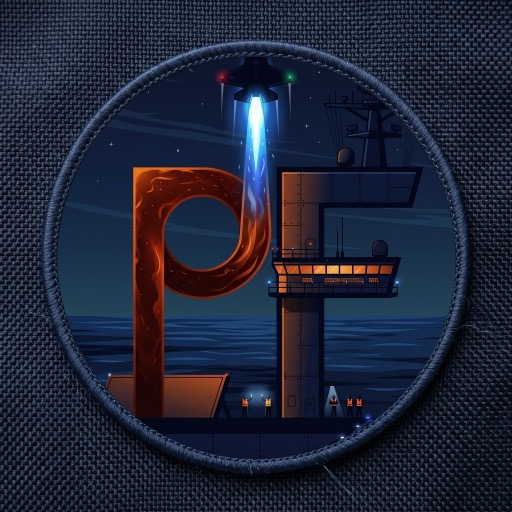

<p align="center">
  
</p>

<h1 align="center">Pri-Fly</h1>

<p align="center">
  Движок устойчивых сценариев на Go: закрепляет сценарий и входы до запуска,
  ведёт честную историю решений и не повторяет действие с неизвестным исходом.
</p>

<p align="center">
  <a href="https://github.com/StenHigh/prifly/actions/workflows/verify.yml"></a>
  <a href="https://github.com/StenHigh/prifly/releases"></a>
  
  
</p>

<p align="center">
  <a href="#быстрый-старт">Быстрый старт</a> ·
  <a href="#готовые-сценарии-из-git-репозиториев">Сценарии из репозиториев</a> ·
  <a href="#что-умеет-pri-fly">Возможности</a> ·
  <a href="#документация">Документация</a> ·
  <a href="https://github.com/StenHigh/prifly-workflows">Каталог сценариев</a> ·
  <a href="https://github.com/StenHigh/prifly-aif-workflows">AI Factory</a>
</p>

<p align="center">
  
</p>

## Что это

Pri-Fly управляет запуском работы, сохраняет решения и результаты, а также
помогает не повторить действие, исход которого неизвестен. Сценарий
описывается читаемым YAML и компилируется в неизменяемый контракт запуска;
локальная authority хранит историю Run, решения, receipts и evidence.

Это не обвязка вокруг конкретной модели или трекера задач. Pri-Fly не вызывает
LLM сам: ИИ, человек или обычная программа могут быть исполнителем шага с
явным контрактом. Готовые сценарии, например путь AI Factory, живут в
отдельных репозиториях и ставятся в проект через каталог.

## Быстрый старт

Установка не требует Go или прав администратора. Скопируйте одну команду в
обычный терминал:

```sh
(install_file="$(mktemp)" || exit; curl --fail --location --silent --show-error https://github.com/StenHigh/prifly/releases/latest/download/install.sh -o "$install_file" && sh "$install_file"; install_exit=$?; rm -f "$install_file"; exit "$install_exit")
```

Она сначала сохраняет bootstrap в локальный файл, а не передаёт ответ сети
напрямую в shell. Установщик скачивает `release-manifest.json` того же Release
и до установки сверяет SHA-256 скачанного архива: при несовпадении он
отказывается и не оставляет binary. Ключа на машине ещё нет, подпись проверить
нечем, поэтому доверие первой установки — это HTTPS до GitHub; последующий
`prifly update` уже проверяет подпись release перед заменой binary. Скрипт не меняет shell profile: если понадобится, он подскажет, как
добавить `~/.local/bin` в `PATH`.

Текущая public stable release matrix точно ограничена `linux/amd64` и
`darwin/arm64` (Apple Silicon). Другие архитектуры, включая `linux/arm64` и
Intel macOS, пока не поддерживаются. Для разработки и contributors остаётся
сборка из исходников: нужен Go версии из [go.mod](go.mod), а для полного набора
native tests также нужен C compiler. Установщик никогда не подменяет
отсутствующий asset сборкой из исходников.

```sh
git clone https://github.com/StenHigh/prifly.git
cd prifly
go build -o bin/prifly ./cmd/prifly
bin/prifly --help
```

Установленный через bootstrap binary обновляется только по явной команде:

```sh
prifly update
```

Она не обновляет workflows, `.prifly/`, authority или уже запущенные drivers.
Собранный из исходников и вручную скопированный binary намеренно откажет:
сначала нужна официальная установка.

Затем инициализируйте проект и посмотрите объявленные точки запуска:

```sh
prifly project init --repository .
prifly project workflows --repository . --json
```

Для contributor-проверки:

```sh
make check
make e2e
```

`make` использует локально настроенный Go toolchain. Если он расположен не в
`.tools/go`, передайте свой путь: `make check GO=/path/to/go`.

## Готовые сценарии из Git-репозиториев

Проект с `.prifly/` может получить Project workflow folder из любого
Git-репозитория и из [каталога сценариев](https://github.com/StenHigh/prifly-workflows).
Сеть используется только этими явными командами; `init`, `project workflows`
и `project start` остаются offline.

```sh
prifly project workflows search                       # официальный каталог github.com/StenHigh/prifly-workflows
prifly project workflows add aif-classic              # запись каталога → .prifly/workflows/aif-classic
prifly project workflows add owner/repo --ref v1.2.0  # или любой Git URL; --path DIR, если сценариев несколько
prifly project workflows update aif-classic           # к exact commit того же ref; локальные правки — отказ
prifly project workflows remove aif-classic
```

`add` копирует только обычные файлы папки с marker
`prifly-project-workflow/1`, объявляет package и launch в `project.yaml` и
записывает `origin`: repository, path, ref, exact commit и digest дерева.
Ничего из репозитория не исполняется, package не seal-ится и не становится
trusted — это по-прежнему решение владельца при `project start`. Команда
сохраняет свой `extend.yaml` при `update`, а credentials берутся только из
credential helper или SSH пользователя, никогда из URL. Формат каталога —
[`workflow-catalog-authoring-reference.yaml`](examples/authoring/workflow-catalog-authoring-reference.yaml);
сценарии AI Factory — в
[`StenHigh/prifly-aif-workflows`](https://github.com/StenHigh/prifly-aif-workflows).

## Что умеет Pri-Fly

| | |
|---|---|
| **Закрепляет до запуска** | точные версии сценария, входов и компонентов; alias, branch или URL разрешаются только до lock |
| **Ведёт локальную authority** | история Run, решения, receipts и evidence на вашей машине, вне репозитория |
| **Различает исходы** | успешный, неудачный и неопределённый; повтор не считается безопасным по умолчанию, а неопределённое обязательство закрывает владелец явной командой |
| **Читаемый YAML** | сценарии, шаги, схемы и контексты компилируются в неизменяемый контракт запуска |
| **Решения Run** | объявленные вопросы задаются до старта одним диалогом, а динамические ждут через универсальный Decision Bridge |
| **Независимость** | не привязан к AI Factory, GitLab, GitHub, Jira или провайдеру модели |

Точные границы реализованного, roadmap и контрактов — не в README, а в
OpenSpec.

## Документация

| Нужно узнать | Где смотреть |
|---|---|
| Какое правило менять | [Карта источников](openspec/SOURCE-OF-TRUTH.md) |
| Модель продукта и поведение сценариев | [OpenSpec capabilities](openspec/specs/) |
| Текущий объём и порядок работы | [Delivery roadmap](openspec/specs/delivery-roadmap/spec.md) |
| Поставка, установка и обновление | [Release distribution](openspec/specs/release-distribution/spec.md) |
| Термины Pri-Fly и Go/JSON-соответствия | [Словарь](openspec/specs/specification-governance/terms.md) |
| YAML authoring и пакеты | [Workflow and context](openspec/specs/workflow-and-context/spec.md) |
| Решения Run и Decision Bridge | [Run decisions](openspec/specs/run-decisions/spec.md) |
| Публичные JSON contracts | [Published contracts](openspec/specs/published-contracts/spec.md) |
| Примеры и справочники YAML | [examples/](examples/README.md) |
| Сообщить о проблеме безопасности | [Security policy](SECURITY.md) |

## Как развивать спецификацию

Нормативные изменения Pri-Fly ведутся через OpenSpec. Откройте карту
источников, выберите capability и создайте change с proposal, requirements,
design и tasks. OpenSpec — инструмент разработки этого репозитория, а не часть
поставляемого binary или формат пользовательского YAML.

```sh
npm install -g @fission-ai/openspec@1.11.0
openspec new change my-change
openspec validate my-change --strict
```

Правила для агентов и contributors находятся в
[governance](openspec/specs/specification-governance/spec.md).
